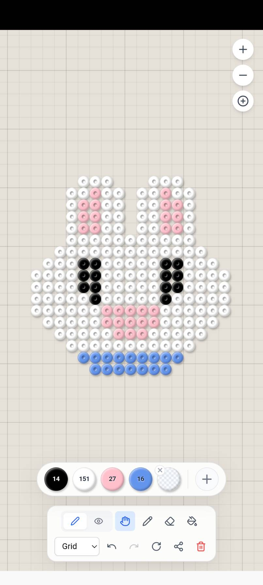
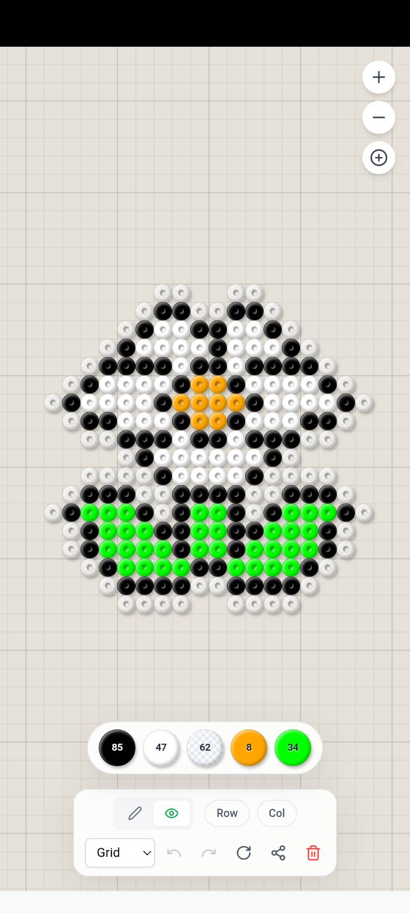

# Dot Weaver

Dot Weaver is a modern, intuitive, and highly interactive pixel art and perler bead drawing application. Built with React and an infinite canvas architecture, it allows users to freely create dot-based art, share their creations effortlessly via URL, and use it seamlessly on any device.

## Screenshots

|                                                                                                                                                                                                                       Editor Interface                                                                                                                                                                                                                       |                                                                                                                                                                                                                                     Shared Artwork Example                                                                                                                                                                                                                                      |
| :----------------------------------------------------------------------------------------------------------------------------------------------------------------------------------------------------------------------------------------------------------------------------------------------------------------------------------------------------------------------------------------------------------------------------------------------------------: | :---------------------------------------------------------------------------------------------------------------------------------------------------------------------------------------------------------------------------------------------------------------------------------------------------------------------------------------------------------------------------------------------------------------------------------------------------------------------------------------------: |
|                                                                                                                                                                                                                                                                                                                                                                                              |                                                                                                                                                                                                                                                                                                                                                                                                           |
| The main editor interface provides an infinite canvas for drawing. It features a versatile toolbar for panning, drawing, erasing, and filling, along with a floating color palette for quick color adjustments.<br><br>[View this artwork live](https://huskyhsu.github.io/dot-weaver/?s=MwLgtAjAHOBsIQOwgMQDEOYD7rQYQAY8AhHA8inWAFgE4BWAUQBERqB9YAQWE68XYAmLsWFCRw2Oy6DRXcbK5SZchcSXTZY4YqkQIXeuwjde3QXnoy83dtWtWLUB9dpdL7-YeKx5V%2BsRWvEGBhsYGArTMtOyIzEA) | When you finish your creation, you can share it effortlessly. The entire artwork's state is compressed and synced to the URL, allowing anyone to view it instantly.<br><br>[View this artwork live](https://huskyhsu.github.io/dot-weaver/?s=MwLgtAjALOCsIQBwgE4HMBGBDAFAJllgBoACA4sw0gBgDpYBKAHwGJr2PWAxH37rgIKx2rdj3YgAbAH08AvLIEQI0%2BQCE5eNQICcqjQGEteA9oDs%2BqKeCmhqqGqOOHA4JdN4AImqvb3P718BVS0bDW8bLVdFYEctA1i5GQE1SVsZKBTfTLdXDQEHOVjglOAAUW0NCtLq-XLjMtDqhSyKvAqoatyfRp7tWHt8lwtMhUygA) |

## Features

- **Infinite Canvas:** Pan and zoom smoothly across an unbounded drawing area without worrying about canvas limits, powered by `@use-gesture/react`.
- **Drawing Tools:** Fully featured toolbar supporting different modes including Pan, Draw, Erase, and Fill.
- **Customizable Color Palette:** A floating palette for quick color selection, allowing you to easily add or remove custom colors.
- **Real-Time URL Syncing:** Your drawing state is automatically compressed (using `lz-string`) and synced to the URL. You can share your artwork simply by copying the link!
- **History Management:** Robust Undo and Redo functionality built-in.
- **Progressive Web App (PWA):** Installable on desktop and mobile devices for an app-like experience with offline capabilities, powered by `vite-plugin-pwa` and Workbox.

## Tech Stack

- **Framework:** [React 19](https://react.dev/) + [Vite](https://vitejs.dev/)
- **Styling:** [Tailwind CSS](https://tailwindcss.com/)
- **State Management:** [Zustand](https://github.com/pmndrs/zustand)
- **Canvas Gestures:** [@use-gesture/react](https://use-gesture.netlify.app/)
- **Icons:** [Lucide React](https://lucide.dev/)
- **Compression:** [lz-string](https://github.com/pieroxy/lz-string/) (for URL state encoding)
- **Language:** TypeScript

## Getting Started

### Prerequisites

Ensure you have Node.js (version 24.x as specified in `package.json`) and a package manager like `npm` installed.

### Installation

1. Clone the repository and navigate to the project directory:

   ```bash
   git clone <your-repo-url>
   cd dot-weaver
   ```

2. Install dependencies:
   ```bash
   npm install
   ```

### Running the App

To start the development server:

```bash
npm run dev
```

Open [http://localhost:5173](http://localhost:5173) in your browser to view the application.

### Building for Production

To create a production-ready build:

```bash
npm run build
```

To preview the production build locally:

```bash
npm run preview
```

## Architecture Overview

- **`src/features/canvas`**: Contains the `InfiniteCanvas` and `BeadsLayer` components responsible for rendering the grid, drawing logic, and panning/zooming.
- **`src/features/toolbar`**: Houses the `Toolbar` and `FloatingPalette` UI elements.
- **`src/store`**: Zustand stores (`useAppStore`, `useBeadsStore`, `useCanvasStore`) that manage app states, tool selections, bead placements, history, and URL synchronization.

## License

MIT
